# Magnus Laser

A cyberpunk-themed desktop application for managing tabletop RPG game elements. This application provides comprehensive tools to manage gangs, buildings, characters, fixer jobs, bounties, items, and tactical combat for your cyberpunk tabletop RPG campaigns.


## Screenshots

### Cyberpunk UI

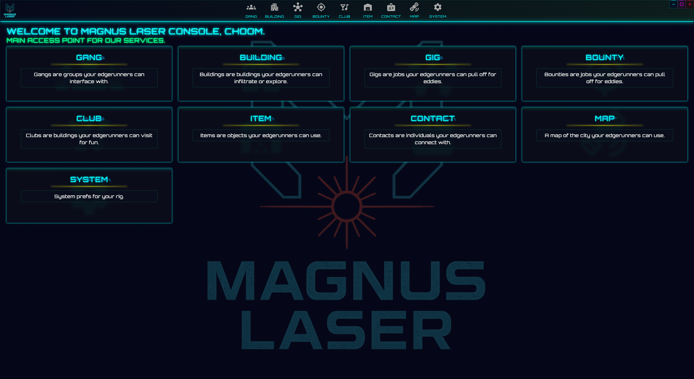
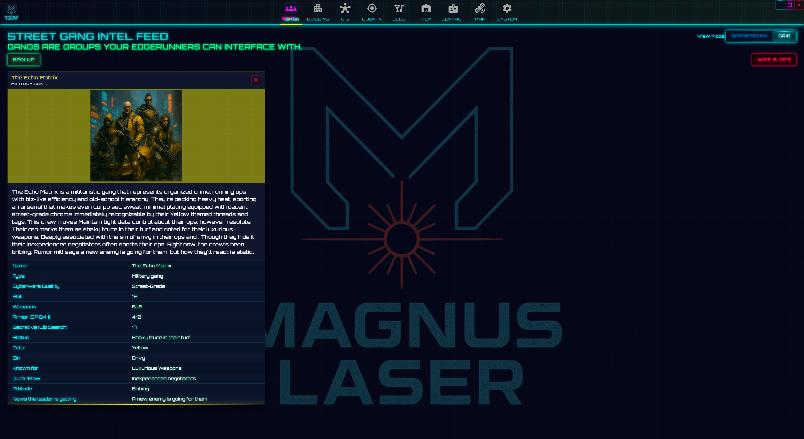
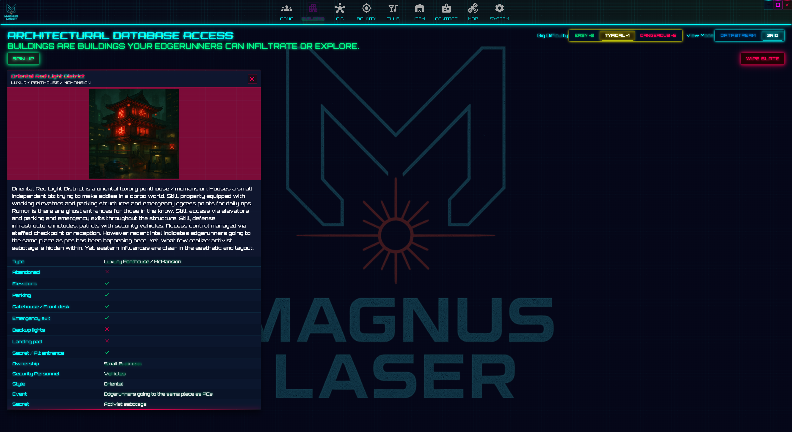
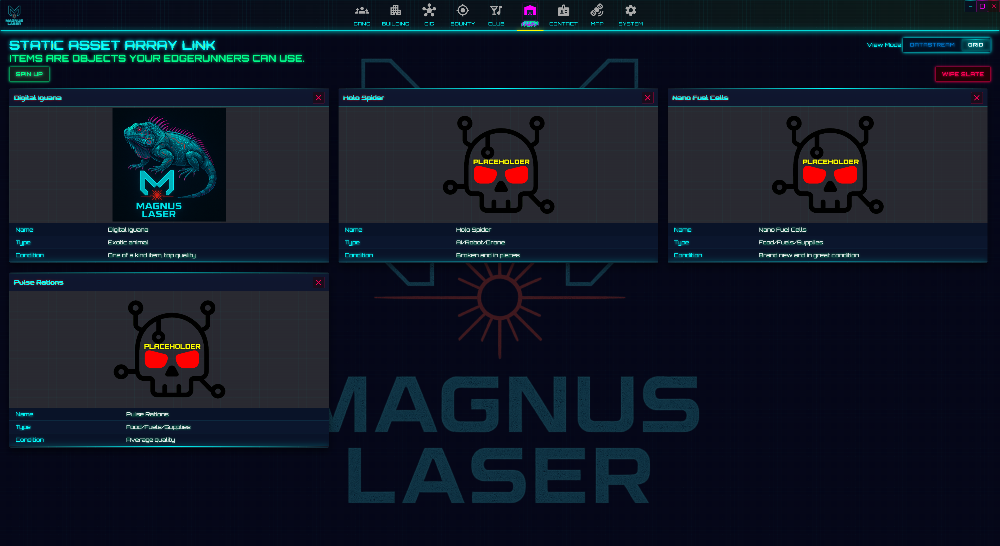
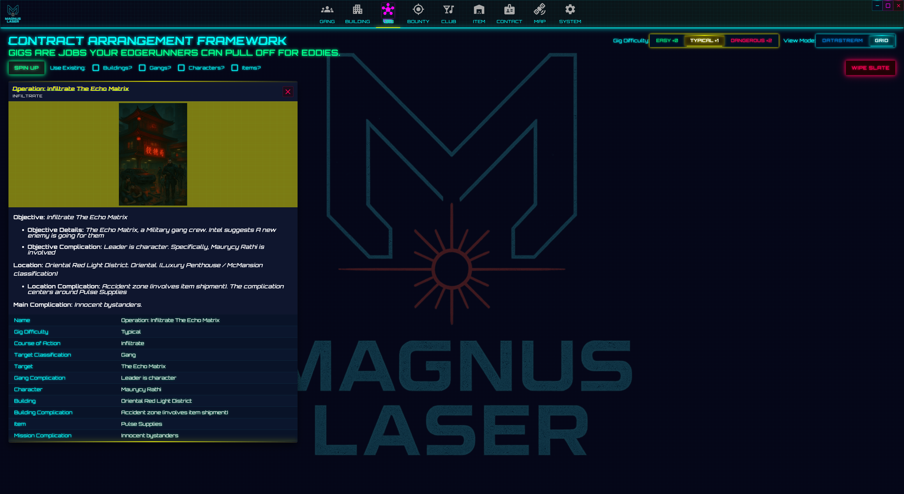
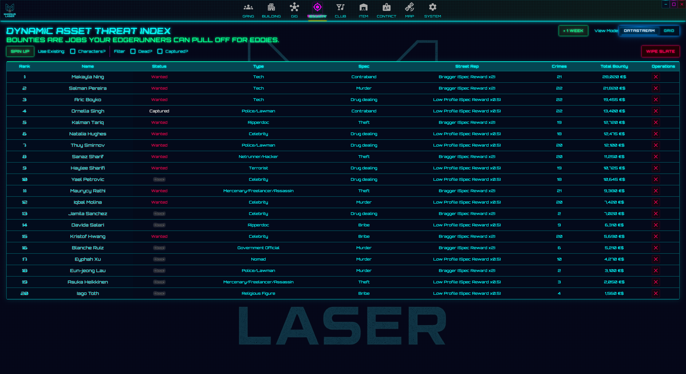
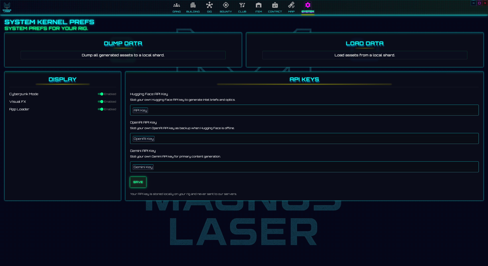
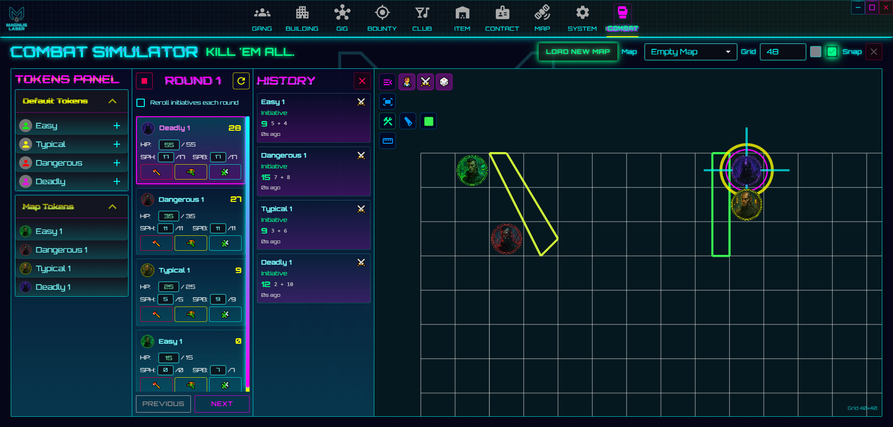

### Reader Mode

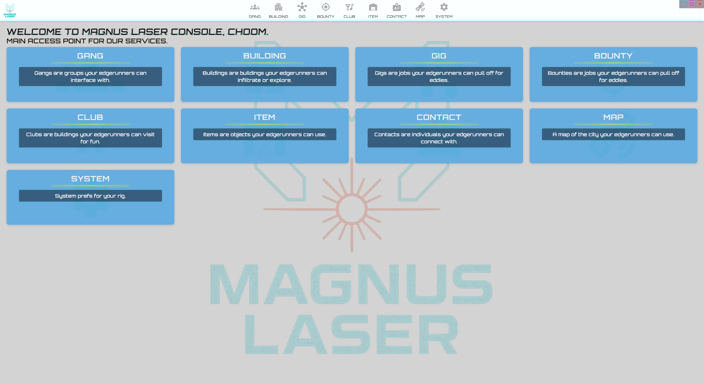
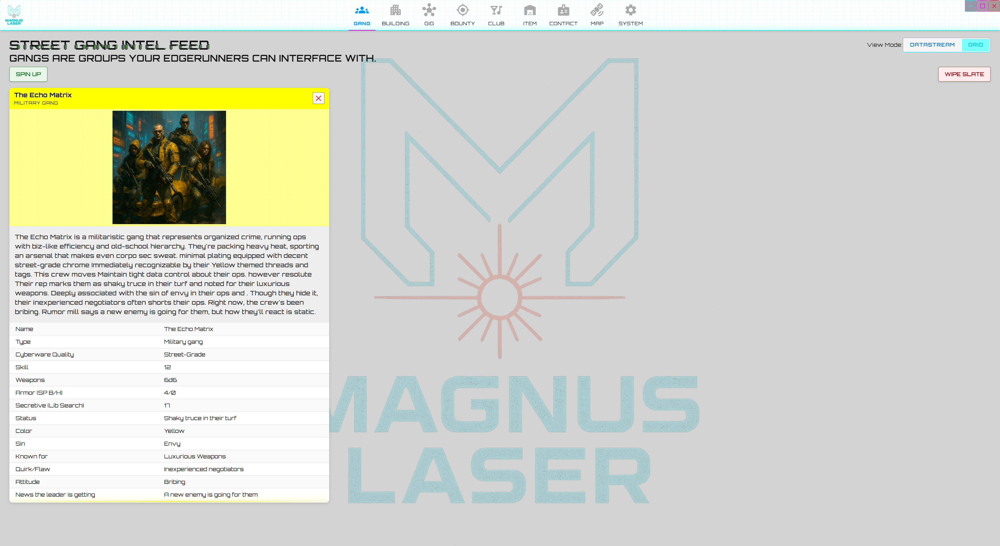
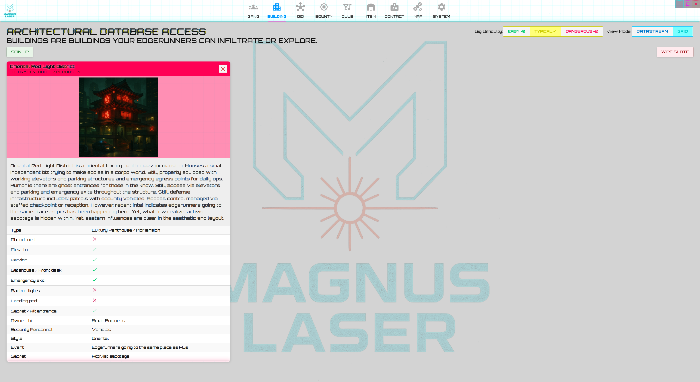
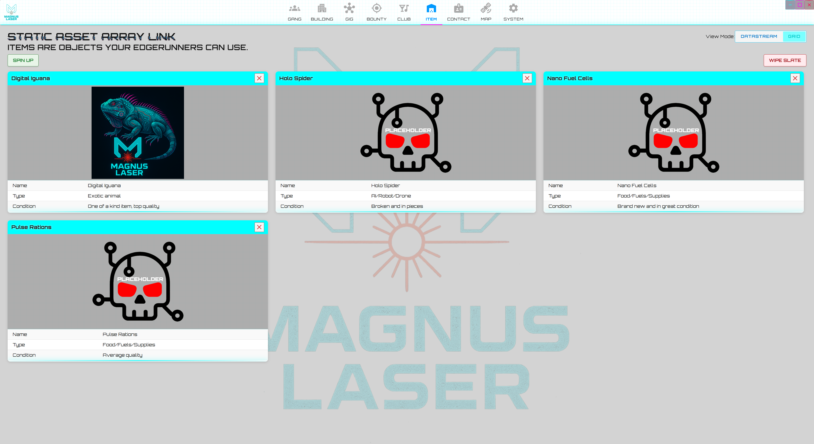
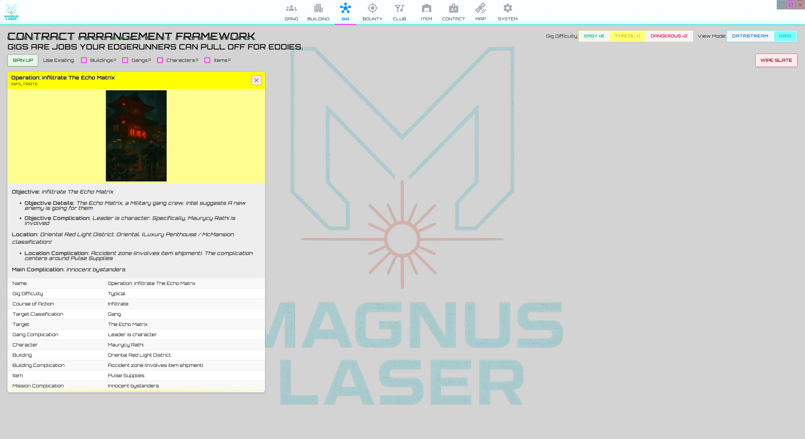
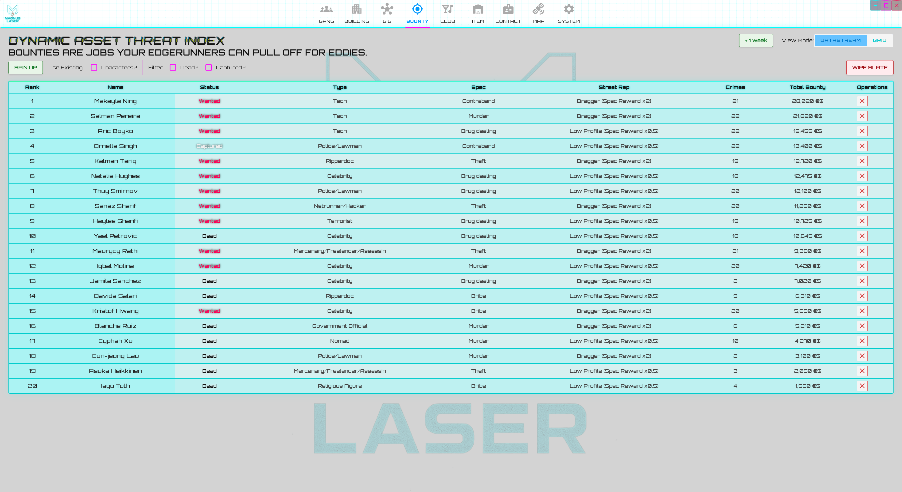
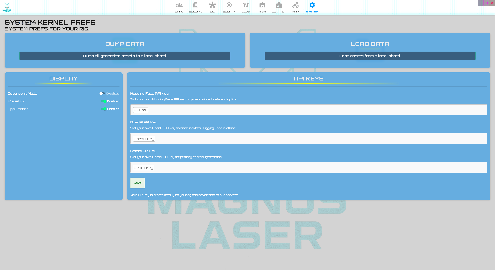
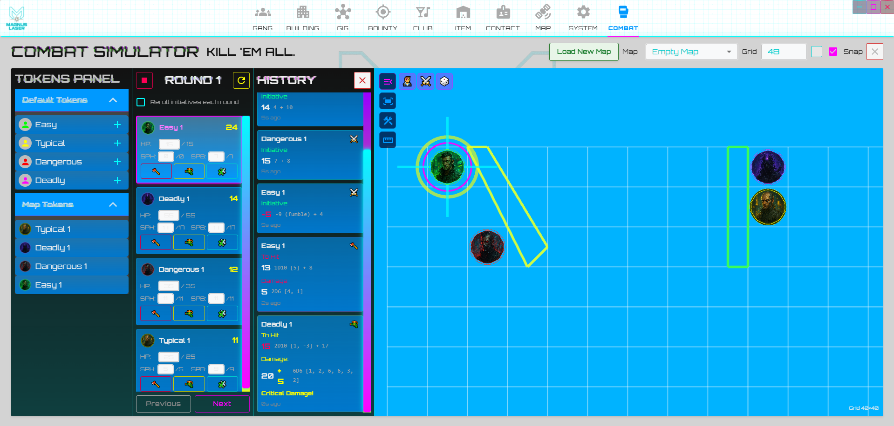

## Features

- **Cyberpunk UI**: Immersive interface with glitch effects, power lines, scanlines, and neon elements.
- **Reader Mode**: Toggle between cyberpunk visual style and a cleaner, more accessible reader mode.
- **Multilingual Support**: Internationalization with i18next and react-i18next. (English available)
- **Module Management**:
  - **Dashboard**: Central hub showing all modules with quick access.
  - **Characters**: Create and manage player (TBD) and non-player characters.
  - **Gangs**: Create and manage gang organizations with detailed hierarchies.
  - **Buildings**: Design and organize buildings and locations with rich metadata.
  - **Clubs**: Manage nightlife and entertainment venues. (Placeholder - TBD)
  - **Items**: Track equipment, weapons, and inventory with detailed stats.
  - **Gigs**: Plan and manage fixer jobs and missions with complex plot structures.
  - **Bounties**: Track and manage bounty hunting activities with target details.
  - **Map**: Interactive map with draggable markers for buildings, gangs, and contacts.
  - **Combat Simulator**: Tactical grid-based combat system with token management, initiative tracking, dice rolling, and line-of-sight mechanics.
  - **Settings**: Configure API keys, reader mode, animations, and other preferences.
- **AI-Assisted Generation**: Auto-generate content using Google Generative AI (Gemini), OpenAI, and Hugging Face APIs.
- **Rich Text Editor**: Integrated TipTap v3 editor for notes and descriptions with markdown support.
- **Interactive Map**: Built with Leaflet and Leaflet Draw for world building and marker management.
- **Data Persistence**: Offline-first storage powered by Dexie (IndexedDB) for automatic saving and loading.
- **Data Import/Export**: Export and import all application data as JSON files for backup and sharing.
- **Notifications**: Real-time in-app notifications with Notistack.
- **Cross-Platform Desktop App**: Packaged with Tauri v2 for macOS, Linux, and Windows.

## Technologies Used

- **Frontend:**

  - React 19.2.0 & React Router v7.9.3
  - TypeScript 5.9.3
  - Material-UI (MUI) v7.3.4
  - i18next 25.5.3 & react-i18next 16.0.0
  - TipTap v3.6.5 for rich text editing
  - PixiJS 8.13.2 & @pixi/react 8.0.3 for combat simulator
  - pixi-viewport 6.0.3 for interactive canvas controls
  - Leaflet 1.9.4 & React Leaflet 5.0.0 for interactive maps
  - Leaflet Draw 1.0.4 for map drawing tools
  - Dexie 4.2.0 for IndexedDB database management
  - @hello-pangea/dnd 18.0.1 for drag and drop functionality
  - Notistack 3.0.2 for notifications
  - Google Generative AI SDK 0.24.1
  - OpenAI & Hugging Face integrations
  - GraphQL 16.11.0 & GraphQL Code Generator 6.0.0
  - @uiw/react-color 2.9.0 & @uiw/react-md-editor 4.0.8
  - DOMPurify 3.2.7 for sanitization
  - date-fns 4.1.0 for date handling
  - smooth-scrollbar 8.8.4 for custom scrolling
  - ESLint 9.37.0 for code quality

- **Desktop:**

  - Tauri 2.8.4 for building cross-platform desktop applications
  - Rust backend with Tauri plugins (fs, shell)

- **Build Tools:**
  - Vite 7.1.9
  - TypeScript Compiler
  - GraphQL Codegen

## Getting Started

### Prerequisites

- Node.js (v18 or later recommended)
- npm or yarn
- Rust (for Tauri v2 development)
- System dependencies for Tauri (see [Tauri v2 prerequisites](https://v2.tauri.app/start/prerequisites/))

### Installation

1. Clone the repository

   ```bash
   git clone https://github.com/Khr0mZ/magnus-laser.git
   cd magnus-laser/client/Magnus-Laser
   ```

2. Install dependencies

   ```bash
   npm install
   # or
   yarn
   ```

3. Start the development server

   ```bash
   npm run dev
   # or
   yarn dev
   ```

4. For desktop development with Tauri:

   ```bash
   npm run tauri dev
   # or
   yarn tauri dev
   ```

5. To build the desktop application for production:

   ```bash
   npm run tauri build
   # or
   yarn tauri build
   ```

6. Open your browser and navigate to `http://localhost:5173`

## Available Scripts

From within the `client/Magnus-Laser` directory:

- `npm run dev` / `yarn dev`: Start Vite development server.
- `npm run build` / `yarn build`: Build web app for production.
- `npm run preview` / `yarn preview`: Preview production build.
- `npm run ts` / `yarn ts`: Run TypeScript compiler in watch mode.
- `npm run lint` / `yarn lint`: Run ESLint checks.
- `npm run ts:lint` / `yarn ts:lint`: Run TypeScript and ESLint together.
- `npm run generate` / `yarn generate`: Generate GraphQL types and hooks.
- `npm run tauri dev` / `yarn tauri dev`: Launch the Tauri desktop app in development mode.
- `npm run tauri build` / `yarn tauri build`: Build the Tauri desktop app for production.

## Project Structure

```
client/Magnus-Laser/
├── src/
│   ├── views/           # Main application views/modules
│   │   ├── Dashboard/   # Central hub
│   │   ├── Character/   # Character management
│   │   ├── Gang/        # Gang organizations
│   │   ├── Building/    # Building/location management
│   │   ├── Item/        # Equipment and inventory
│   │   ├── FixerJob/    # Gigs/missions
│   │   ├── Bounty/      # Bounty hunting
│   │   ├── Map/         # Interactive map
│   │   ├── CombatSim/   # Tactical combat simulator
│   │   └── Settings/    # Application settings
│   ├── components/      # Reusable UI components
│   ├── contexts/        # React contexts for state management
│   ├── utils/           # Utility functions and helpers
│   │   ├── generators/  # AI-powered content generators
│   │   ├── db.ts        # Dexie database configuration
│   │   ├── storage.ts   # Storage utilities
│   │   └── ...
│   ├── graphql/         # GraphQL type definitions
│   └── i18n/            # Internationalization
├── src-tauri/           # Tauri Rust backend
│   ├── src/
│   ├── Cargo.toml
│   └── tauri.conf.json
└── public/              # Static assets
```

## Data Storage

Magnus Laser uses **Dexie.js** (an IndexedDB wrapper) for offline-first data persistence:

- **Database Tables**:
  - `gangs` - Gang organizations
  - `buildings` - Buildings and locations
  - `characters` - NPCs and player characters
  - `items` - Equipment and inventory
  - `fixerJobs` - Missions and gigs
  - `bounties` - Bounty targets and details
  - `preferences` - User settings and API keys
  - `mapMarkers` - Custom map markers

All data is stored locally in your browser's IndexedDB, ensuring:

- Offline functionality
- Fast data access
- Automatic persistence
- Privacy (data never leaves your device unless you export it)

## Combat Simulator

The Combat Simulator is a fully-featured tactical combat system built with PixiJS:

- **Grid-Based Combat**: Customizable grid with adjustable size and cell dimensions
- **Token Management**: Create and manage combat tokens with colors, sizes, and stats
- **Initiative Tracking**: Automatic initiative ordering with manual adjustments
- **Dice Rolling System**: D10-based rolls with critical success/failure handling
  - Attack rolls with modifiers
  - Damage rolls
  - General D10 rolls with special results
- **Tactical Tools**:
  - Wall/barrier placement for line-of-sight mechanics
  - Ruler tool for measuring distances
  - Context menus for quick actions
  - Token tooltips with stats
- **Map Import**: Support for custom background images
- **Persistent Storage**: Separate Dexie database for saving combat scenarios

## Building for Release

To build the Tauri desktop application for production:

```bash
cd client/Magnus-Laser
npm run tauri build
# or
yarn tauri build
```

### Output Location

Built installers will be located at:

```
client/Magnus-Laser/src-tauri/target/release/bundle/
```

### Platform-Specific Installers

- **Windows**:
  - `.msi` installer in `bundle/msi/`
  - `.exe` NSIS installer in `bundle/nsis/`
- **macOS**:
  - `.dmg` disk image in `bundle/dmg/`
  - `.app` bundle in `bundle/macos/`
- **Linux**:
  - `.deb` package in `bundle/deb/`
  - `.AppImage` in `bundle/appimage/`
  - `.rpm` package (if configured)

### Building for Specific Platforms

```bash
# Build only MSI (Windows)
npm run tauri build -- --bundles msi

# Build only NSIS installer (Windows)
npm run tauri build -- --bundles nsis

# Build only DMG (macOS)
npm run tauri build -- --bundles dmg

# Build multiple formats
npm run tauri build -- --bundles msi,nsis
```

## Contributing

Contributions are welcome! Please feel free to submit a Pull Request.

## License

This project is licensed under the MIT License - see the LICENSE file for details.
