# Magnus Laser

A cyberpunk-themed desktop application for managing tabletop RPG campaigns. Magnus Laser provides a comprehensive toolkit for Game Masters and players: world-building databases, AI-powered content generation, a full tactical combat simulator with dual 2D/3D renderers, real-time multiplayer sessions, a 7-step character creator, 17 GM tools, and much more.


## Features

> Looking for a non-technical walkthrough? See the [User Guide](#user-guide) section below.

### Cyberpunk UI

- Immersive interface with glitch effects, scanlines, neon glow, and Matrix rain background
- Custom CyberpunkLoader startup screen with per-module progress bars and hex-address simulation
- Orbitron/Rajdhani fonts, chromatic aberration button effects, and pulsing neon animations
- Full **Reader Mode** toggle: switches to a clean, accessible light theme with no animations

### Multilingual Support

- Internationalization powered by i18next and react-i18next (English and Spanish)
- Language selector in Settings with persistent preference
- Solo play random tables use a dedicated i18n namespace (`tables-en.json`, `tables-es.json`) for independent table content localization

### Main Navigation Modules

- **Dashboard** — Central hub showing primary modules (Map, Combat Simulator, Solo Play, Edgerunners, Settings) as clickable cards with cyberpunk animations.
- **Map** — Interactive Leaflet-based world map with draggable custom markers for buildings, gangs, and contacts. Marker CRUD with persistent storage. Drawing tools via Leaflet Draw.

### World-Building Modules (via GM Tools)

The following modules are accessible from the GM Tools drawer. Each supports grid and table view modes, compact/expanded display, AI-powered random generation, and full CRUD operations with persistent storage.

- **Characters** — Create and manage NPCs with type, attitude, appearance, and AI-generated portraits. Random generation with name, description, and image.
- **Gangs** — Manage gang organizations with cyberware quality, skill levels, weapons, armor, reputation, attitudes, secrets, and flaws. AI-generated profiles and images.
- **Buildings** — Design locations with type, ownership, security personnel, style, events, secrets, parking, elevators, emergency exits, landing pads, and more. AI-generated descriptions and images.
- **Items** — Track equipment and inventory with type, condition, and detailed stats. AI-generated item cards.
- **Gigs (Fixer Jobs)** — Plan missions with difficulty levels (Easy/Typical/Dangerous). AI generation creates the job plus all associated entities (gangs, buildings, characters, items) in one pass. Plot verb system for mission objectives.
- **Bounties** — Track bounty targets linked to characters with crime types (Bribe, Contraband, Drug, Murder, Theft), specialties, rewards, and status tracking (Active/Captured/Dead).

### Edgerunners

Full character sheet management for player characters:

- **10 Base Stats**: INT, REF, DEX, TECH, COOL, WILL, LUCK, MOVE, BODY, EMP (editable, clamped 1-10)
- **Derived Stats**: HP, Seriously Wounded threshold, Death Save, Humanity (current/max), EMP
- **9 Skill Categories**: Awareness, Body, Control, Education, Fighting, Performance, Ranged Weapon, Social, Technique — each skill editable with color-coded proficiency levels
- **Equipment Shopping**: Buy/sell weapons, armor, gear, cyberware, and fashion with real-time eurobucks tracking
  - Cyberware: Foundation slot system, stat requirements, humanity loss tracking, prerequisite validation, unique enforcement, borgware support
  - Fashion: Separate budget from eurobucks
  - 50% refund on resale
- **Lifepath**: Cultural origin, personality, dress style, affectation, motivation, family background, childhood, crisis, life goal
- **IP Tracking**: Staged skill and role rank improvements with cost preview and cascade unstaging
- **Combat Token Sync**: Changes to edgerunner stats automatically sync to associated combat tokens
- **Export**: Download individual edgerunner data as JSON

### Character Creator

7-step guided wizard for creating new characters:

1. **Method Selection** — Choose from three creation paths:
   - _Streetrat_ (beginner): Pre-generated stats and fixed skills
   - _Edgerunner_ (recommended): Stat template with 86 distributable skill points
   - _Complete Package_ (advanced): 62 stat points + 86 skill points + 2,550eb gear budget
2. **Role Selection** — 10 roles (Rockerboy, Solo, Netrunner, Tech, Medtech, Media, Lawman, Exec, Fixer, Nomad), each with unique Role Ability and rank-based scaling mechanics
3. **Stats** — Allocate points across 10 stats with real-time derived stat calculation (HP, Humanity, Death Save, Seriously Wounded threshold)
4. **Skills** — Distribute 86 points across all skills with x2 cost support, basic skill minimums, and free cultural language
5. **Gear Shopping** (Complete Package only) — Night Market interface with 5 tabs (Weapons, Armor, Gear, Cyberware, Fashion). 8 color-coded cyberware categories with slot management, prerequisite tracking, and humanity loss warnings (including cyberpsychosis threshold)
6. **Lifepath** — Randomly generated backstory: cultural origin, personality, style, motivation, family, life events (color-coded: good/bad/friend/enemy/rival). Full reroll support
7. **Finishing Touches** — Name and handle input, character summary card, and save to library

### Solo Play

Quick resolution systems for single-player adventures:

- **Quick & Dirty Combat** — 7-phase streamlined combat system:
  1. _Setup_: Configure edgerunners (with hardened criteria) and enemies (Mook/Lieutenant/Mini-Boss/Boss levels)
  2. _Tactics_: Contested roll to determine attack distribution
  3. _Counting_: Calculate total attacks per side
  4. _Attacking_: Generate individual attack checks with fumble tracking
  5. _Comparing_: Match attacks and determine which hits land, tracking critical injuries and bullet dodge
  6. _Outcome_: Determine winner by comparing total hits per side
  7. _Damage_: Roll damage for enemy hits against edgerunners with armor penetration and critical injury tracking
  - Session data persists across page navigation (stored in IndexedDB) until manually reset

- **Quick & Dirty Netrunning** — Floor-based hacking system:
  - Architecture sizes: Small (3-6 floors, 3 checks), Medium (7-12 floors, 5 checks), Large (13+ floors, 7 checks)
  - Check types: Password, File, Black ICE (opposed)
  - Majority-based success/failure with Black ICE hit accumulation and unsafe jackout consequences
  - Session data persists across page navigation (stored in IndexedDB) until manually reset

### GM Tools

17 specialized tools accessible from the GM Tools drawer:

#### Solo Play Tools (11)

| Tool                       | Description                                                                                                                                                                                                                                                                                                                                                                                                                                                                                                                                                                                                                                                                                                                                |
| -------------------------- | ------------------------------------------------------------------------------------------------------------------------------------------------------------------------------------------------------------------------------------------------------------------------------------------------------------------------------------------------------------------------------------------------------------------------------------------------------------------------------------------------------------------------------------------------------------------------------------------------------------------------------------------------------------------------------------------------------------------------------------------ |
| **Oracle & Random Tables** | Fate determination engine combined with the full random table hub. Closed questions: d100 roll with 5 probability levels (Certain → Impossible) producing 5 answer types. Open questions: random verb + noun + adjective combinations. 65+ random generators across 15 categories (Core, Words, Sensory, Names, Night City, People, Things, Media, Corpse Loot, Mission, SPM Character, SPM Encounters, SPM Atmosphere, SPM Combat, SPM Medical) plus a zone/time-based encounter generator. Campaign selector: all results tagged by campaign. Oracle History side panel: unified scrollable feed of oracle results, open questions, random table rolls, and inline text notes — filterable by campaign, with per-entry reroll and delete |
| **Clocks**                 | Dice pool countdown system (3-10 d6). Removes 1s on roll, optional 6s removal (scale-up mode). Devil's Luck mechanic, add-dice-back recovery. Roll history with degree-of-consequence bonuses                                                                                                                                                                                                                                                                                                                                                                                                                                                                                                                                              |
| **Mission Builder**        | Solo mission generator with employer types (Fixer/Corpo/Gang), payment, summary, focus, specifics, and twist. Per-section reroll, save/load, clipboard copy                                                                                                                                                                                                                                                                                                                                                                                                                                                                                                                                                                                |
| **Beat Chart**             | Story structure tracker with 4 beat types (Hook/Development/Climax/Resolution). Multi-chart tabs, 1-10 development steps, progress bar with completion tracking                                                                                                                                                                                                                                                                                                                                                                                                                                                                                                                                                                            |
| **Investigation**          | Research check tracker. Complexity levels (Simple=3, Average=5, Difficult=7 checks). Skill + DV rolls with success/failure counting and majority determination                                                                                                                                                                                                                                                                                                                                                                                                                                                                                                                                                                             |
| **Social Challenge**       | NPC interaction tracker. Importance levels (Background/Supporting/Key) determine check count. Opposed skill rolls with win/tie/loss tracking                                                                                                                                                                                                                                                                                                                                                                                                                                                                                                                                                                                               |
| **NPC Tracker**            | Character status monitor with status tracking (Alive/Dead/Missing/Unknown), role, first encounter, relationship, mood, and notes. Random generators for each field                                                                                                                                                                                                                                                                                                                                                                                                                                                                                                                                                                         |
| **IP Tracker**             | Improvement Points ledger per edgerunner. Track earned vs. spent IP with date, amount, and spend-on description. Auto-calculated available IP                                                                                                                                                                                                                                                                                                                                                                                                                                                                                                                                                                                              |
| **Scene Tracker**          | Session structure tracker with auto-numbered scenes. Track location, participants, goal, outcome, notes. Attachable checks with completion tracking. Random location generator                                                                                                                                                                                                                                                                                                                                                                                                                                                                                                                                                             |
| **NPC Forms**              | NPC creation in two modes: Simple (name, handle, role, look, quirk, mood, notes) and Complex (adds 10 CB3010 stats, combat stats, HP, initiative, reputation, equipment, cyberware)                                                                                                                                                                                                                                                                                                                                                                                                                                                                                                                                                        |
| **Random Things**          | Custom d3-d20 random tables with weighted probability. Visual percentage display per item. Create, edit, roll, and delete custom tables                                                                                                                                                                                                                                                                                                                                                                                                                                                                                                                                                                                                    |

#### Content Generators (6)

AI-powered generators that create entities and persist them to the main database:

| Generator              | Output                                                                          |
| ---------------------- | ------------------------------------------------------------------------------- |
| **Gang Generator**     | Full gang profiles with all properties                                          |
| **Building Generator** | Locations with type, status, and details                                        |
| **Gig Generator**      | Fixer jobs with cascading entity creation (gangs, buildings, characters, items) |
| **Bounty Generator**   | Bounty targets with crime generation and auto-created characters                |
| **Item Generator**     | Equipment with type and categorization                                          |
| **Contact Generator**  | Standalone NPC characters                                                       |

### AI-Assisted Content Generation

Three-tier fallback strategy for generating names, descriptions, and images:

1. **Google Gemini** (gemini-2.0-flash for text, Imagen 3.0 for images) — preferred
2. **Hugging Face** (Mistral-7B-Instruct for text, Stable Diffusion XL for images) — fallback
3. **OpenAI** (GPT-3.5-turbo for text, DALL-E 3 for images) — fallback
4. **Local procedural generation** — deterministic templates when all APIs fail

All generated content uses cyberpunk-themed prompts and is automatically persisted to IndexedDB. Image regeneration available from entity edit dialogs.

### Additional Features

- **Rich Text Editor** — TipTap v3 with markdown support for notes and descriptions
- **Data Persistence** — Offline-first storage via Dexie (IndexedDB) with 24+ database tables. Automatic saving and loading
- **Data Import/Export** — Export and import all application data (or individual modules) as JSON files for backup and sharing
- **Notifications** — Real-time in-app notifications with Notistack
- **Cross-Platform Desktop App** — Packaged with Tauri v2 for macOS, Linux, and Windows

## Combat Simulator

A fully implemented tactical combat system with real-time multiplayer synchronization, supporting both 2D and 3D rendering modes.

### Dual Renderer

- **2D Mode (PixiJS)** — Default canvas-based renderer with pixi-viewport for pan/zoom
- **3D Mode (Three.js)** — Toggle to a full 3D board with camera presets, cyberpunk materials, and 3D models for tokens, walls, and blasts

### Grid & Board

- Customizable grid with adjustable cell size, color, and alpha
- Snap-to-grid with 9-point snapping (vertices, centers, edge midpoints)
- Custom background images (upload, manage, replace, delete)
- Per-map settings persistence

### Token Management

- Create tokens with custom name, color (8 neon presets), and size
- Full stat block: HP, armor (head/body with current tracking), movement, initiative, and combat actions (melee/ranged/grenade/skill with damage dice)
- PC tokens with luck stat
- Custom token images from asset library
- 3D model assignment with orientation control
- Owner assignment for multiplayer (players control their own tokens)
- Drag-and-drop positioning, copy/cut/paste via clipboard
- Context menus for quick actions, hover tooltips with stats, and right-click target assignment

### Walls & Barriers

- Draw walls in three shapes: line, rectangle, and circle
- Custom wall colors and alpha
- Wall erasing tool
- Walls serve as barriers for line-of-sight calculations

### Blast & Area-of-Effect

- Four blast types: grenade, circle, square, and cone
- Adjustable size and positioning
- Lock/unlock blasts on the board
- Drag-and-drop placement

### Line of Sight

- Visibility polygon calculation using 360 regular 1-degree rays plus endpoint-targeted rays
- Canvas 2D offscreen rendering with `destination-out` compositing to punch visibility holes
- Wall collision detection for accurate line-of-sight blocking
- Works identically in both 2D and 3D renderers

### Combat System

- **Per-Map Initiative** — Each map maintains its own initiative state: active token, current round, combat active flag, and auto-settings
- **Dice Rolling** — D10-based system with attack rolls (modifiers), damage rolls (auto-roll option), and general rolls. Critical success/failure and fumble handling
- **Roll History** — Per-map roll log sorted by timestamp with damage reveal system (hidden until GM reveals)
- **Auto-Settings** — Per-map auto-reroll initiative and auto-roll damage toggles

### Tactical Tools

- **Measurement Ruler** — Click-and-drag distance measurement
- **Floating Buttons** — Quick access to wall drawing modes, erasing, measurement, panel toggles, and color pickers
- **Side Panels** — Token panel, Initiative panel, Roll History panel, Blasts panel
- **Target Overlay** — Tokens support a target list. When a token is selected, a HUD panel (bottom-left) shows all its current targets with colored dot and name. Assign or remove targets via right-click context menu in both 2D and 3D renderers

### 3D-Specific Features

- Camera presets for different viewing angles
- Cyberpunk-themed materials and shaders
- 3D model loader for tokens, walls, and blast effects
- Board labels and wall/blast previews during placement

### Multiplayer Sync

All combat state syncs in real-time between DM and players (see Session Hosting below).

## Session Hosting

Magnus Laser ships with a free click-to-host relay for your tabletop sessions. Everything runs on your machine — no logins, no paid infrastructure.

### Setup

1. **Install `cloudflared`:** Download the standalone binary from [Cloudflare](https://developers.cloudflare.com/cloudflare-one/connections/connect-apps/install-and-setup/installation) and place it somewhere on your PATH.
2. **Launch the Session view:** Inside the desktop app open **Settings** in the navigation bar. Pick a display name, choose the **Game Master** role, and click **Create Session**. The app spins up a local WebSocket relay and exposes it through a Cloudflare Quick Tunnel.
3. **Share the invite:** Copy the public URL + session code and send them to your players. They only need those values to join — no accounts or extra software.
4. **Join as a player:** Players select the **Player** role, paste the host's URL/code, and connect.
5. **End the session:** When you click **End Session** the tunnel and local WebSocket server are shut down cleanly.

### Transport Architecture

- **Primary: WebRTC data channels** — Direct peer-to-peer connection for lowest latency. Uses STUN/TURN servers for NAT traversal.
- **Fallback: WebSocket relay** — If WebRTC fails to connect within 9 seconds, the system automatically falls back to relaying through the Cloudflare tunnel.
- **Auto-reconnect** — Players automatically rejoin their last session on app restart. Exponential backoff with tab-visibility awareness and PING/PONG heartbeat.

### State Synchronization

- **Snapshot-based sync** — DM watches all combat tables for changes and broadcasts full snapshots (250ms debounce)
- **Chunked asset streaming** — Large map images and assets are split into 64KB chunks with SHA256 hash verification
- **Ownership validation** — Players can only modify tokens they own; DM validates all mutations before applying
- **Pending movement** — Players declare movements, DM approves or rejects
- **Session tables** — Players write to separate session-prefixed tables (`sessionTokens`, `sessionMaps`, etc.) to isolate their view from local prep data

### Backend Options

- **Tauri desktop** — Built-in `start_host` command spawns the WebSocket server and Cloudflare tunnel directly
- **Companion server** — Standalone Rust server (Axum + tokio-tungstenite) at `server/` for headless hosting

All persistent state lives in Dexie/IndexedDB on each client. The relay layer handles presence, signaling, and message forwarding without storing game data on any third-party servers.

## User Guide

This section walks you through every screen in Magnus Laser, explaining what you can do and how things work. No technical knowledge required — just open the app and follow along.

> For a detailed technical feature list, see the [Features](#features) section above.

---

### Dashboard

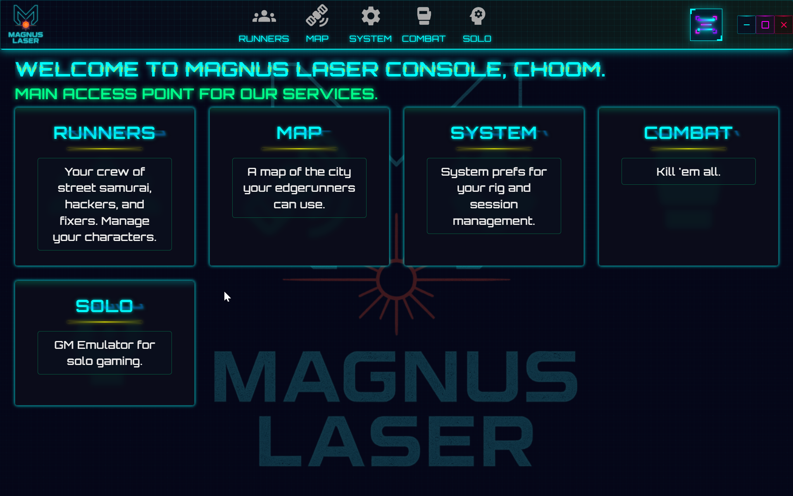

The Dashboard is the first screen you see when you open Magnus Laser. It shows a grid of clickable cards, one for each module in the app: Map, Combat Simulator, Solo Play, Edgerunners, and Settings. Click any card to jump straight into that module.

If the cyberpunk animations are too intense, you can turn on **Reader Mode** in Settings for a clean, calm light theme.

---

### Map

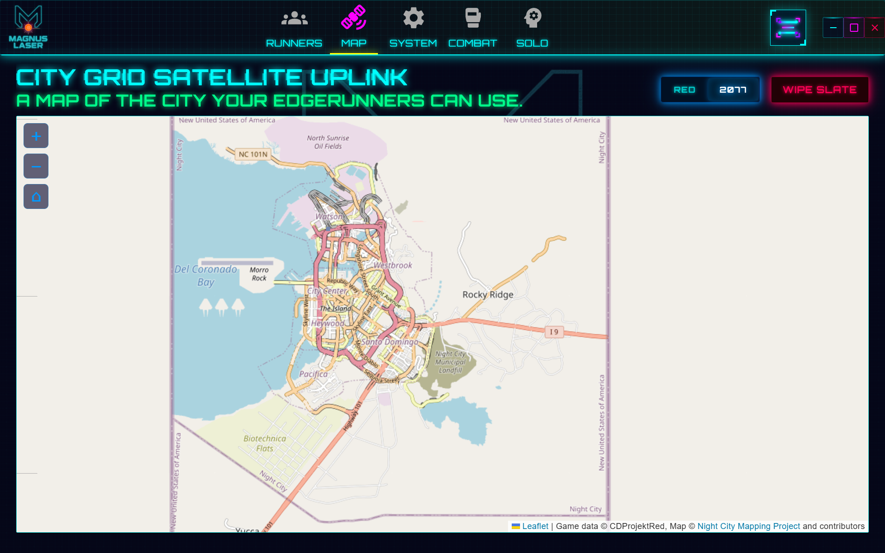

An interactive world map for your campaign. Place custom markers to track locations, gangs, contacts, and anything else you want to remember on the map.

- **Two map modes** — Use the toggle at the top to switch between **RED** (the Cyberpunk RED city map) and **2077** (a real-world style map)
- **Add markers** — Click the map to drop a marker, then fill in a name and description
- **Edit and move markers** — Click an existing marker to edit its details, or drag it to a new position
- **Save and load** — Markers are saved automatically. Use the buttons to clear all markers if you want to start fresh
- **Drawing tools** — Sketch zones and areas directly on the map using the built-in drawing tools

---

### Combat Simulator

The tactical battle system — the heart of Magnus Laser. Here you can create battle maps, place tokens for characters and enemies, draw walls and obstacles, drop area-of-effect blasts, and run full initiative-based combat with dice rolling. It supports a top-down 2D view and an optional 3D perspective, and the GM can host multiplayer sessions so everyone sees the same board in real time.

#### Board, Walls & Environment

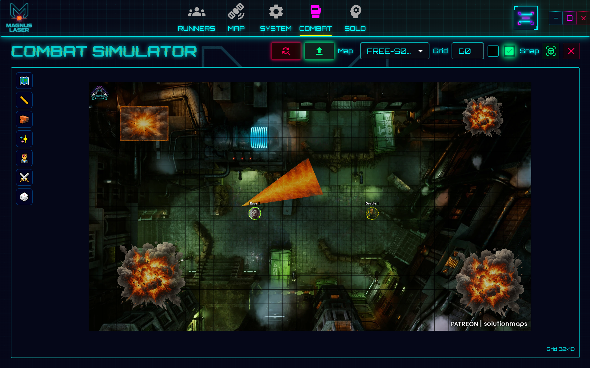

- **Maps** — Upload your own background images or pick from saved maps using the dropdown at the top. You can manage multiple maps and switch between them during a session
- **Grid** — Customize the grid cell size, color, and opacity from the floating controls. Toggle snap-to-grid so tokens and walls align neatly to the grid
- **Zoom & pan** — Scroll to zoom in/out, click and drag the background to pan around the board
- **Walls** — Draw walls in three shapes (line, rectangle, circle) using the wall tool buttons. Pick a custom color for each wall. Use the eraser tool to remove walls. Walls block line of sight
- **Blasts & area effects** — Drop area-of-effect shapes on the board: grenade, circle, square, or cone. Adjust their size, drag them to reposition, and lock them in place so they don't move accidentally
- **Line of Sight** — When a token is selected, areas behind walls are hidden from that token's perspective. Walls block vision realistically and visibility updates automatically as tokens move

#### Tokens & Combat

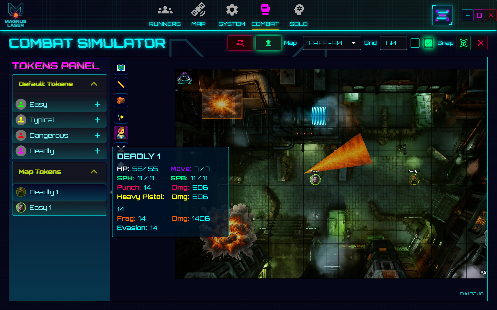

- **Create tokens** — Open the Token panel (left side) and create tokens with a name, color, and size. Assign a full stat block: HP, head and body armor, movement, initiative modifier, and combat actions (melee, ranged, grenade, skill) with damage dice
- **Place and move** — Drag tokens from the panel onto the board. Once placed, drag them to reposition. Right-click a token for quick actions (duplicate, delete, target, etc.)
- **Custom images** — Assign a custom image to any token from your asset library for easy identification
- **Targeting** — Right-click a token and assign targets. A HUD panel at the bottom-left shows all current targets for the selected token
- **Initiative** — Open the Initiative panel to start combat. Roll initiative for all tokens, see the turn order, and advance through turns. The active token is highlighted on the board. A round counter tracks how many rounds have passed
- **Dice rolling** — Roll attacks and damage from the Initiative panel. The system uses D10 dice with modifiers, handles critical successes and fumbles, and logs every roll in the Roll History panel. The GM can choose when to reveal damage results to players
- **Measurement** — Use the ruler tool to click-and-drag between two points to measure distance on the board
- **Copy & paste** — Cut, copy, and paste tokens between maps using standard clipboard shortcuts

#### 2D & 3D Modes

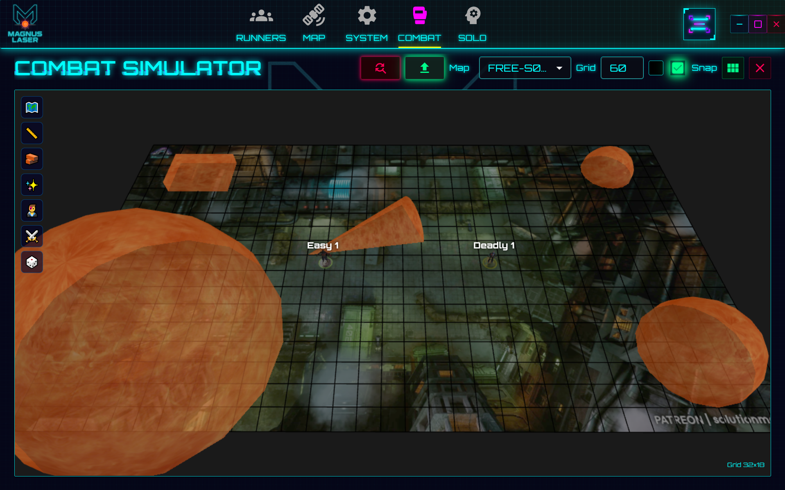

- **2D Mode** — The default top-down view, optimized for performance. Pan by dragging the background, zoom with the scroll wheel
- **3D Mode** — Toggle the switch at the top of the board to switch to a full 3D perspective. Camera presets let you pick different viewing angles, and the board uses cyberpunk-themed materials and lighting with 3D models for tokens, walls, and blasts. Everything works the same as in 2D — it's just a different way to see the board

#### Multiplayer

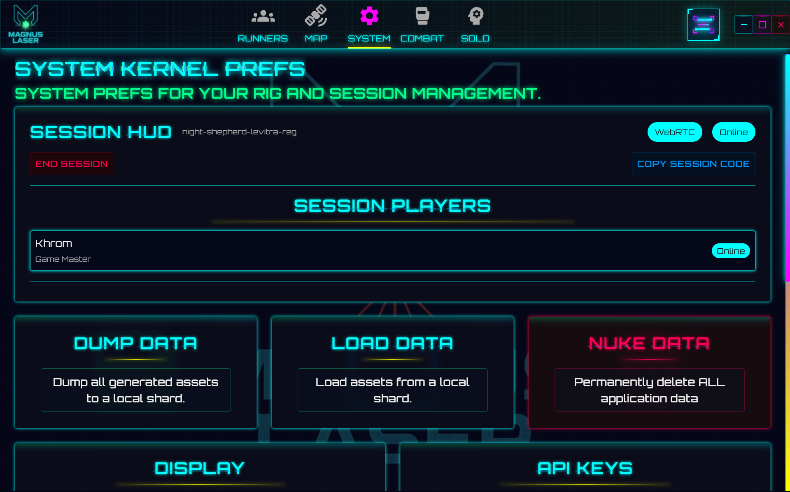

- The GM creates a session in Settings, then shares a session code with players. Players join using that code, and from that moment everything syncs in real time: maps, tokens, walls, blasts, initiative, and dice rolls
- Players can only move tokens they own, and the GM approves or rejects movements
- See the [Settings](#settings) section for setup instructions

---

### Solo Play

Two quick-resolution systems for playing solo without a Game Master. Switch between them using the tabs at the top. Both systems persist your active session data across page navigation — you can leave and come back without losing progress. Data is only cleared when you click the Reset button.

#### Quick & Dirty Combat

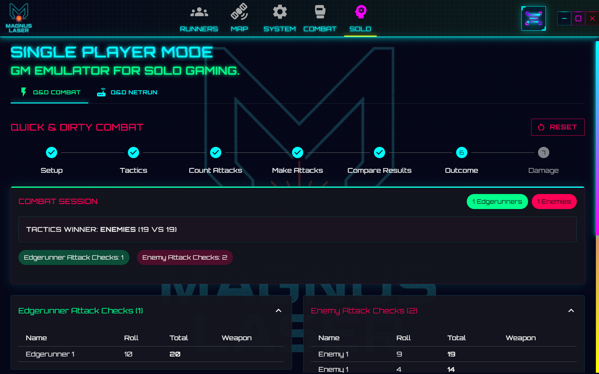

A streamlined 7-phase combat system that resolves an entire fight in minutes:

1. **Setup** — Add your edgerunners and configure enemies. Choose enemy difficulty levels: Mook (easy), Lieutenant, Mini-Boss, or Boss (hardest). Enable special abilities like Speedware or High Reflexes for your characters
2. **Tactics** — A contested roll determines which side has the upper hand and how attacks are distributed
3. **Counting** — The system calculates how many total attacks each side gets
4. **Attacking** — Individual attack checks are rolled for each combatant, tracking fumbles and hits
5. **Comparing** — Attacks are matched up and hits are determined, tracking critical injuries and bullet dodges
6. **Outcome** — The winner is determined by comparing total hits per side
7. **Damage** — Roll damage for enemy hits against edgerunners with armor penetration and critical injury tracking

#### Quick & Dirty Netrunning

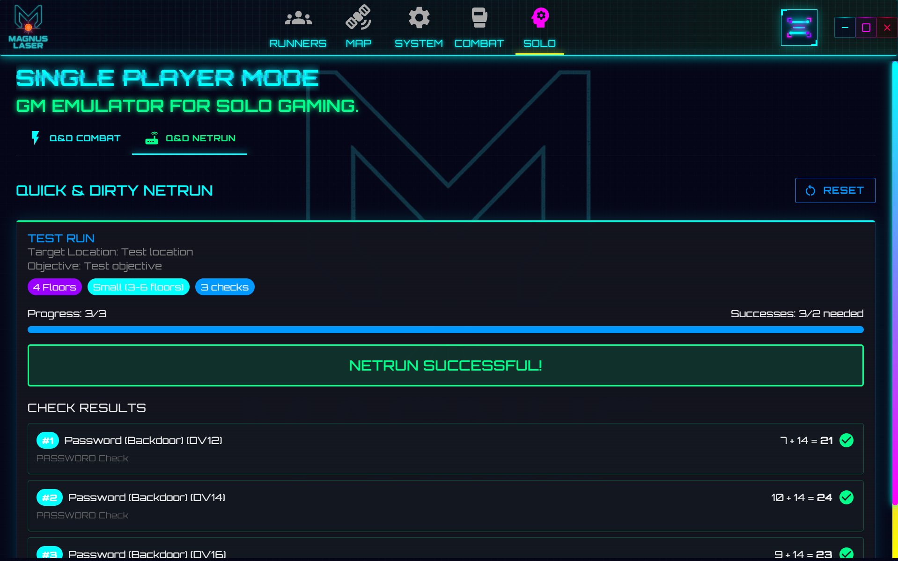

A floor-by-floor hacking simulation for Netrunners:

- **Pick an architecture** — Small (3–6 floors, 3 checks), Medium (7–12 floors, 5 checks), or Large (13+ floors, 7 checks)
- **Work through the floors** — Each floor presents a random check: Password, File, or Black ICE. Roll against each one
- **Black ICE is dangerous** — Failed Black ICE checks deal damage to your Netrunner and can cost you programs
- **Outcome** — If the majority of your checks succeed, the run is a success. If not, it fails — and if your Netrunner took too much damage, you may have to perform an unsafe jackout with consequences

---

### Edgerunners

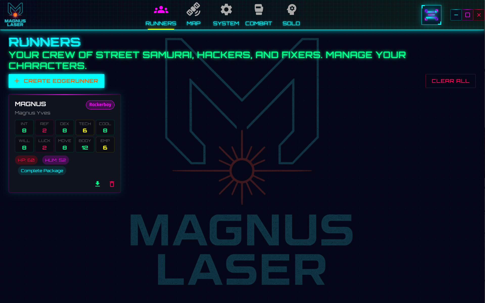

Your character library — a place to manage all your player characters (Edgerunners) with full character sheets.

- **Stats** — Each character has 10 base stats (INT, REF, DEX, TECH, COOL, WILL, LUCK, MOVE, BODY, EMP) plus derived stats like HP, Seriously Wounded threshold, Death Save, and Humanity
- **Skills** — 9 skill categories with individual skill levels. Color-coded proficiency levels make it easy to see at a glance what your character is good at
- **Equipment shop** — Buy and sell weapons, armor, gear, cyberware, and fashion from a built-in shop. Eurobucks are tracked in real time with a 50% refund when you sell items back. Cyberware has slot requirements, stat prerequisites, and humanity loss tracking
- **Lifepath** — A backstory section with cultural origin, personality, style, motivation, family background, and life events
- **IP tracking** — Track Improvement Points earned and spent to level up skills and role ranks. The system previews costs and shows you staged improvements before you commit
- **Combat sync** — Changes to an edgerunner's stats automatically sync to any linked token in the Combat Simulator
- **Export** — Download any individual character's data as a JSON file for backup or sharing

---

### Character Creator

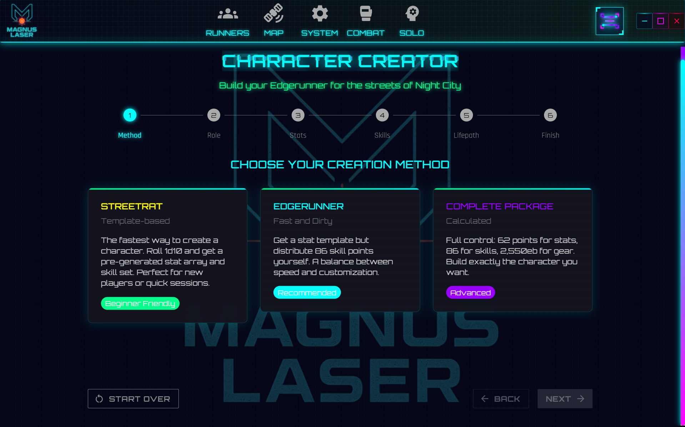

A guided 7-step wizard for building a new Edgerunner from scratch. The wizard validates your choices at each step so you can't accidentally create an invalid character.

1. **Method** — Choose how much control you want: _Streetrat_ (beginner, pre-built stats), _Edgerunner_ (recommended, distribute skill points), or _Complete Package_ (advanced, full control over stats, skills, and gear)
2. **Role** — Pick from 10 roles (Rockerboy, Solo, Netrunner, Tech, Medtech, Media, Lawman, Exec, Fixer, Nomad). Each has a unique Role Ability that scales with rank
3. **Stats** — Allocate points across your 10 base stats. Derived stats (HP, Humanity, Death Save) are calculated automatically
4. **Skills** — Distribute 86 skill points across all available skills. Some skills cost double (x2). A free cultural language is included
5. **Gear** — _(Complete Package only)_ Shop for weapons, armor, gear, cyberware, and fashion in a Night Market interface. Cyberware is organized by 8 color-coded categories with slot management, prerequisite tracking, and humanity loss warnings
6. **Lifepath** — Generate a random backstory with cultural origin, personality, style, motivation, family, and life events (color-coded as good, bad, friend, enemy, or rival). Reroll anything you don't like
7. **Finish** — Enter a name and handle, review the summary card, and save your new Edgerunner to the library

---

### Settings

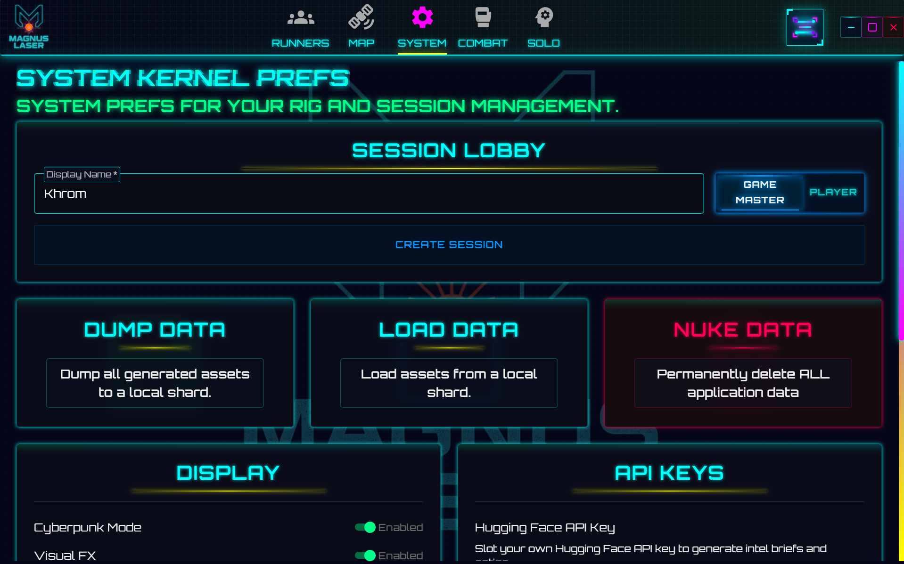

All your preferences and configuration in one place.

- **Display** — Toggle **Reader Mode** for a clean, accessible light theme with no animations. Turn the startup loader animation on or off. Enable or disable all cyberpunk visual effects
- **Language** — Switch between English and Spanish. The setting is saved and applies immediately
- **Session management** — Create or join multiplayer sessions:
  - As **Game Master**: pick a display name, click Create Session, and share the generated session code with your players
  - As **Player**: enter the host's URL and session code, then click Join
  - The GM can see connected players, kick someone if needed, and end the session at any time
- **API keys** — Enter API keys for **Google Gemini**, **Hugging Face**, or **OpenAI** to enable AI-powered content generation (character portraits, gang profiles, building descriptions, etc.). Without API keys, the app falls back to local procedural generation
- **Data management** — **Export** all your data as a JSON file for backup. **Import** data from a previously exported file. **Nuke Database** wipes everything and gives you a fresh start (use with caution!)

---

### GM Tools

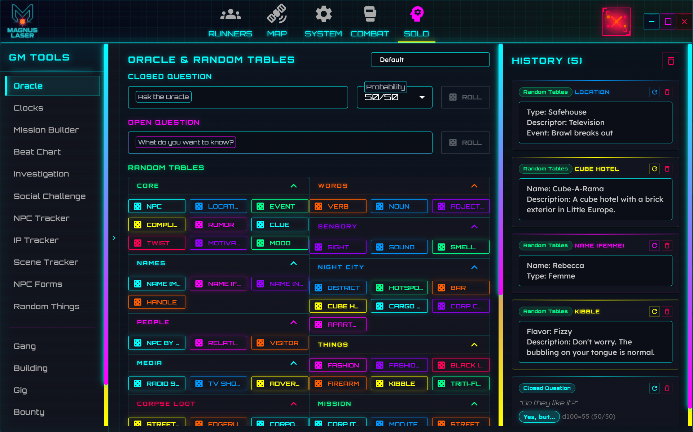

Click the hamburger menu icon (top-right of the navigation bar) to open the GM Tools drawer. It contains 17 specialized tools organized in two categories. Each tool opens directly in the drawer without leaving your current page.

#### Solo Play Tools

| Tool | What it does |
| --- | --- |
| **Oracle & Random Tables** | Ask yes/no questions to a virtual oracle (with adjustable probability), generate random word combos for story inspiration, and roll on 65+ random tables across 15 categories. All results are saved to a campaign-tagged history panel |
| **Clocks** | Track countdown-style challenges using a pool of dice (3–10 d6). Roll to remove dice — when the pool is empty, the clock is done. Great for looming threats and time pressure |
| **Mission Builder** | Generate a random solo mission with an employer, payment, summary, focus, specifics, and a plot twist. Reroll any individual section you don't like |
| **Beat Chart** | Outline your story structure with beats (Hook, Development, Climax, Resolution). Track progress through each act with a visual progress bar |
| **Investigation** | Run a research challenge. Pick a complexity level (Simple, Average, Difficult), then make skill rolls — the majority of successes or failures determines the outcome |
| **Social Challenge** | Resolve a conversation or negotiation with an NPC. The NPC's importance (Background, Supporting, Key) determines how many checks you need |
| **NPC Tracker** | Keep tabs on important NPCs: their status (alive, dead, missing), role, mood, relationship to the party, and notes. Random generators for quick NPC creation |
| **IP Tracker** | Log Improvement Points earned and spent by each edgerunner, with dates and descriptions. Automatically calculates available IP |
| **Scene Tracker** | Track scenes during a session: location, participants, goal, outcome, and notes. Attach checks to scenes and mark them complete. Includes a random location generator |
| **NPC Forms** | Create NPC stat blocks in two modes: Simple (name, handle, role, look, quirk) or Complex (full stats, combat values, equipment, cyberware) |
| **Random Things** | Build your own custom random tables with 3–20 entries and weighted probabilities. Roll on them anytime you need a quick random result |

#### Content Generators

AI-powered generators that create content and save it directly to your database. Requires at least one API key configured in [Settings](#settings). Without API keys, a local fallback generates basic content.

| Generator | What it does |
| --- | --- |
| **Gang Generator** | Creates a complete gang profile: name, description, cyberware, weapons, reputation, and an AI-generated image |
| **Building Generator** | Creates a location with type, ownership, security, style, secrets, and more |
| **Gig Generator** | Creates a full fixer job plus all related entities (gangs, buildings, characters, items) in one go — the most powerful generator |
| **Bounty Generator** | Creates a bounty target with a crime, specialty, reward, and an auto-generated character profile |
| **Item Generator** | Creates an equipment item with type, condition, and stats |
| **Contact Generator** | Creates a standalone NPC with name, description, appearance, and an AI-generated portrait |

---

## Technologies Used

- **Frontend:**
  - React 19.2.0 & React Router v7.9.3
  - TypeScript 5.9.3
  - Material-UI (MUI) v7.3.4
  - i18next 25.5.3 & react-i18next 16.0.0
  - Zustand 4.5.4 for state management
  - TipTap v3.6.5 for rich text editing
  - PixiJS 8.13.2 & @pixi/react 8.0.3 for 2D combat rendering
  - Three.js 0.181.2 for 3D combat rendering
  - pixi-viewport 6.0.3 for interactive canvas controls
  - Leaflet 1.9.4 & React Leaflet 5.0.0 for interactive maps
  - Leaflet Draw 1.0.4 for map drawing tools
  - Dexie 4.2.0 for IndexedDB database management
  - @hello-pangea/dnd 18.0.1 for drag and drop
  - Notistack 3.0.2 for notifications
  - @uiw/react-color 2.9.0 for color picking
  - DOMPurify 3.2.7 for sanitization
  - date-fns 4.1.0 for date handling
  - smooth-scrollbar 8.8.4 for custom scrolling
  - diff 8.0.2 for state patching

- **AI Providers:**
  - Google Generative AI SDK 0.24.1 (Gemini)
  - OpenAI API (GPT-3.5-turbo, DALL-E 3)
  - Hugging Face API (Mistral-7B, Stable Diffusion XL)

- **Desktop:**
  - Tauri 2.8.4 for cross-platform desktop applications
  - Rust backend with Tauri plugins (fs, shell)

- **Server (Companion):**
  - Rust with Axum 0.7 web framework
  - tokio async runtime
  - tokio-tungstenite for WebSocket
  - Cloudflare tunnel integration (cloudflared subprocess)

- **Build Tools:**
  - Vite 7.1.9
  - TypeScript 5.9.3
  - ESLint 9.37.0
  - GraphQL Codegen 6.0.0
  - Vitest 2.1.4 for testing

## Getting Started

### Prerequisites

- Node.js (v18 or later recommended)
- npm or yarn
- Rust (for Tauri v2 development)
- System dependencies for Tauri (see [Tauri v2 prerequisites](https://v2.tauri.app/start/prerequisites/))

### Installation

1. Clone the repository

   ```bash
   git clone https://github.com/Khr0mZ/magnus-laser.git
   cd magnus-laser/client/Magnus-Laser
   ```

2. Install dependencies

   ```bash
   npm install
   ```

3. Start the development server

   ```bash
   npm run dev
   ```

4. For desktop development with Tauri:

   ```bash
   npm run tauri dev
   ```

5. To build the desktop application for production:

   ```bash
   npm run tauri build
   ```

6. Open your browser and navigate to `http://localhost:5173`

## Available Scripts

From within the `client/Magnus-Laser` directory:

| Script                        | Description                                      |
| ----------------------------- | ------------------------------------------------ |
| `npm run dev`                 | Start Vite development server                    |
| `npm run build`               | TypeScript check + Vite production build         |
| `npm run preview`             | Preview production build locally                 |
| `npm run ts`                  | Run TypeScript compiler in watch mode            |
| `npm run lint`                | Run ESLint checks                                |
| `npm run ts:lint`             | Run TypeScript and ESLint together               |
| `npm run generate`            | Generate GraphQL types and hooks                 |
| `npm run test`                | Run Vitest in watch mode                         |
| `npm run test:run`            | Run Vitest once                                  |
| `npm run tauri dev`           | Launch the Tauri desktop app in development mode |
| `npm run tauri build`         | Build the Tauri desktop app for production       |
| `npm run tauri:build:windows` | Build for Windows (x86_64)                       |
| `npm run tauri:build:linux`   | Build for Linux (x86_64)                         |
| `npm run tauri:build:macos`   | Build for macOS (x86_64)                         |

## Project Structure

```
magnus-laser/
├── client/Magnus-Laser/
│   ├── src/
│   │   ├── views/                   # Main application views
│   │   │   ├── Dashboard/           # Central hub
│   │   │   ├── Character/           # NPC management
│   │   │   ├── Gang/                # Gang organizations
│   │   │   ├── Building/            # Location management
│   │   │   ├── Item/                # Equipment and inventory
│   │   │   ├── FixerJob/            # Gigs and missions
│   │   │   ├── Bounty/              # Bounty hunting
│   │   │   ├── Map/                 # Interactive world map
│   │   │   ├── CombatSim/           # Tactical combat simulator
│   │   │   │   ├── components/      # React UI (panels, dialogs, menus)
│   │   │   │   ├── componentsPixi/  # 2D renderer (PixiJS)
│   │   │   │   ├── componentsThree/ # 3D renderer (Three.js)
│   │   │   │   ├── hooks/           # Custom combat hooks
│   │   │   │   ├── context/         # Combat context providers
│   │   │   │   └── utils/           # Geometry, grid, visibility, dice
│   │   │   ├── Edgerunners/         # PC character sheet management
│   │   │   ├── CharacterCreator/    # 7-step character creation wizard
│   │   │   ├── SoloPlay/            # Quick combat & netrunning
│   │   │   └── Settings/            # App configuration & sessions
│   │   ├── components/              # Reusable UI components
│   │   │   ├── common/              # Themed inputs, dialogs, scrollbars
│   │   │   ├── GMTools/             # 17 GM tools (11 solo play + 6 generators)
│   │   │   │   └── tools/           # Individual tool modules
│   │   │   ├── NavigationDrawer/    # Main navigation
│   │   │   └── session/             # SessionLobby, SessionHUD
│   │   ├── contexts/                # DataContext, UserPreferencesContext
│   │   ├── state/                   # Zustand session store
│   │   ├── sync/                    # Combat sim sync logic
│   │   ├── net/                     # Signaling, WebRTC, relay transport
│   │   ├── types/                   # TypeScript type definitions
│   │   ├── utils/                   # Utility functions and helpers
│   │   │   ├── generators/          # AI-powered content generators
│   │   │   ├── db.ts                # Dexie database configuration
│   │   │   ├── storage.ts           # Storage utilities
│   │   │   └── colors.ts            # Cyberpunk color palette
│   │   ├── graphql/                 # GraphQL type definitions
│   │   └── i18n/                    # Internationalization (en.json, es.json, tables-en.json, tables-es.json)
│   ├── src-tauri/                   # Tauri Rust backend
│   │   ├── src/
│   │   │   ├── main.rs              # Tauri app entry
│   │   │   ├── api.rs               # API handlers
│   │   │   ├── server.rs            # WebSocket server
│   │   │   ├── host.rs              # Host/tunnel management
│   │   │   └── tunnel.rs            # Cloudflare tunnel integration
│   │   ├── Cargo.toml
│   │   └── tauri.conf.json
│   └── public/                      # Static assets
│       ├── blasts/                  # 2D blast sprites
│       ├── models3d/                # 3D models (tokens, walls, blasts, UI)
│       ├── map/                     # Map tiles
│       ├── logos/                   # Brand assets
│       └── fonts/                   # Custom fonts
├── server/                          # Companion Rust server
│   ├── src/
│   │   ├── main.rs                  # Server entry (Axum)
│   │   ├── api.rs                   # REST endpoints
│   │   ├── server.rs                # WebSocket signaling + rooms
│   │   ├── host.rs                  # Session lifecycle
│   │   └── tunnel.rs                # Cloudflare tunnel spawning
│   └── Cargo.toml
└── graphql/                         # GraphQL schema definitions
    ├── bounty/
    ├── building/
    ├── character/
    ├── fixerJob/
    ├── gang/
    └── item/
```

## Data Storage

Magnus Laser uses **Dexie.js** (an IndexedDB wrapper) for offline-first data persistence.

### Core Entity Tables

| Table                   | Primary Key | Indexes                         | Purpose                     |
| ----------------------- | ----------- | ------------------------------- | --------------------------- |
| `gangs`                 | `ID`        | `&name`                         | Gang organizations          |
| `buildings`             | `ID`        | `&name`                         | Buildings and locations     |
| `characters`            | `ID`        | `&name`                         | NPCs and player characters  |
| `items`                 | `ID`        | `&name`                         | Equipment and inventory     |
| `bounties`              | `ID`        | `characterId`                   | Bounty targets and details  |
| `fixerJobs`             | `ID`        | `plotId`                        | Missions and gigs           |
| `plots`                 | `ID`        | `plotBuildingId, plotSubjectId` | Mission plot structures     |
| `plotBuildings`         | `ID`        | `buildingId`                    | Plot-building relationships |
| `plotComplications`     | `ID`        | `characterId, itemId`           | Plot complications          |
| `buildingComplications` | `ID`        | `characterId, itemId`           | Building complications      |
| `preferences`           | `id`        | —                               | User settings and API keys  |
| `mapMarkers`            | `id`        | —                               | Custom map markers          |
| `kv`                    | `key`       | —                               | Key-value app settings      |

### Combat Simulator Tables

| Table         | Primary Key | Indexes                     | Purpose                       |
| ------------- | ----------- | --------------------------- | ----------------------------- |
| `boardMaps`   | `id`        | `&name`                     | Combat map configurations     |
| `tokens`      | `id`        | `mapId`                     | Combat tokens with stats      |
| `maps`        | `id`        | `&name`                     | Map image assets              |
| `walls`       | `id`        | `mapId`                     | Barrier placement             |
| `images`      | `id`        | `&name`                     | Custom image assets           |
| `blasts`      | `id`        | `mapId`                     | Area-of-effect visualizations |
| `initiative`  | `mapId`     | —                           | Per-map initiative state      |
| `rollHistory` | `id`        | `tokenId, timestamp, mapId` | Per-map dice roll history     |

### Session Tables (Player Mirror)

During multiplayer sessions, players write to session-prefixed mirrors of all combat tables (`sessionBoardMaps`, `sessionTokens`, `sessionMaps`, `sessionWalls`, `sessionImages`, `sessionBlasts`, `sessionInitiative`, `sessionRollHistory`) to isolate session state from local prep data.

All data is stored locally in your browser's IndexedDB, ensuring:

- Offline functionality
- Fast data access
- Automatic persistence
- Privacy (data never leaves your device unless you export it)

## Building for Release

To build the Tauri desktop application for production:

```bash
cd client/Magnus-Laser
npm run tauri build
```

### Output Location

Built installers will be located at:

```
client/Magnus-Laser/src-tauri/target/release/bundle/
```

### Platform-Specific Installers

- **Windows**:
  - `.msi` installer in `bundle/msi/`
  - `.exe` NSIS installer in `bundle/nsis/`
- **macOS**:
  - `.dmg` disk image in `bundle/dmg/`
  - `.app` bundle in `bundle/macos/`
- **Linux**:
  - `.deb` package in `bundle/deb/`
  - `.AppImage` in `bundle/appimage/`

### Building for Specific Platforms

```bash
# Build only MSI (Windows)
npm run tauri build -- --bundles msi

# Build only NSIS installer (Windows)
npm run tauri build -- --bundles nsis

# Build only DMG (macOS)
npm run tauri build -- --bundles dmg

# Build multiple formats
npm run tauri build -- --bundles msi,nsis
```

## Companion Server

The `server/` directory contains a standalone Rust server for headless session hosting (alternative to the built-in Tauri host).

### Server Endpoints

| Method | Path               | Description                                      |
| ------ | ------------------ | ------------------------------------------------ |
| `GET`  | `/health`          | Health check                                     |
| `POST` | `/api/host/start`  | Create a session (spawns cloudflared tunnel)     |
| `POST` | `/api/host/stop`   | End the current session                          |
| `GET`  | `/api/host/status` | Get session status (running, code, URLs, uptime) |
| `POST` | `/api/host/kick`   | Kick a player from the session                   |
| `WS`   | `/signal`          | WebSocket signaling endpoint (11 message types)  |

### Running the Server

```bash
cd server
cargo run -- --host 127.0.0.1 --port 3030
```

The server manages in-memory room state with automatic 2-hour TTL cleanup. No database required.

## Contributing

Contributions are welcome! Please feel free to submit a Pull Request.

## License

This project is licensed under the MIT License - see the LICENSE file for details.
